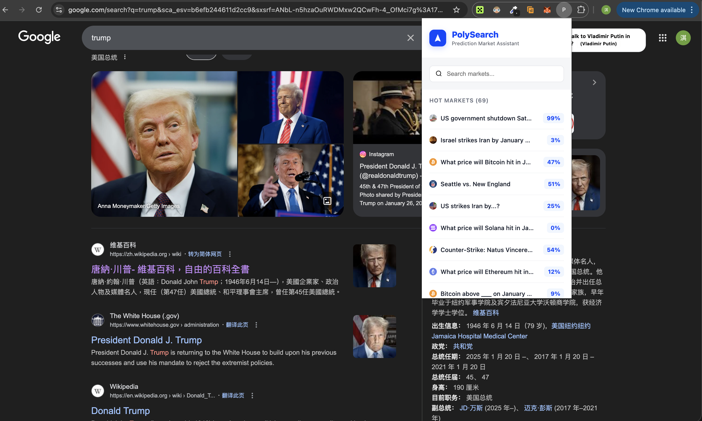
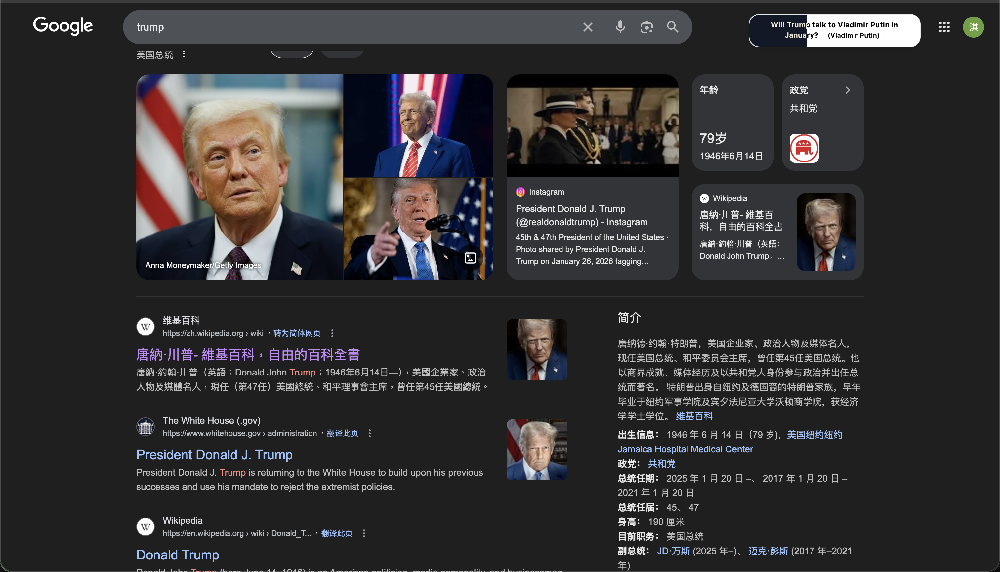
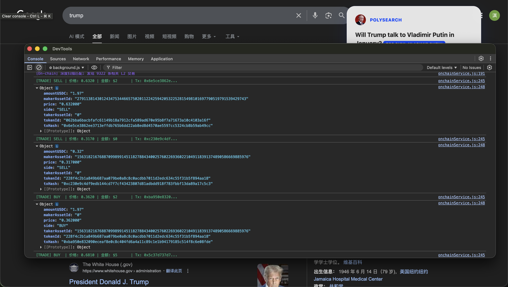

# PolySearch 演示说明

本文档将展示 PolySearch 插件的核心功能及其在 Google 搜索中的实际表现。

## 演示步骤

### 1. 触发智能搜索匹配
在 Google 中输入与预测市场相关的关键词（如 `trump` 或 `china`），插件会自动在后台进行语义匹配。

*图1：搜索关键词后，右侧自动弹出毛玻璃风格的市场信息卡片*

### 2. 交互式 UI 展示
匹配成功后，卡片会展示市场的胜率（Odds）、交易量以及截止日期。数字带有平滑的滚动动画效果。

*图2：展示具体的预测选项（如 "Top Pick: Yes"）及实时成交额*

### 3. 滚动自动收纳
当你向下滚动搜索结果页时，卡片会自动收缩为精简的胶囊形态，并置顶悬浮，不干扰阅读。

*图3：向下滚动后，卡片自动切换为置顶胶囊形态，并保留核心进度条*

### 4. 开发者控制台与链上实时日志
打开 Background Service Worker 的控制台，你可以看到插件正在实时解析的链上原始交易数据。

*图4：控制台实时打印 [TRADE] 日志，包含买卖方向、精确成交价及交易哈希*

## 预期输出
- **视觉反馈**：精致的毛玻璃 UI (Glassmorphism)，与 Google 搜索结果完美融合。
- **性能表现**：本地倒排索引确保匹配延迟 < 50ms。
- **数据深度**：直接解析 Polygon 链上原始 `OrderFilled` 协议，获取最真实的市场成交细节。

## 演示数据
- **示例市场**: `will-there-be-another-us-government-shutdown-by-january-31`
- **示例交易**: `0x916cad96dd5c219997638133512fd17fe7c1ce72b830157e4fd5323cf4f19946`
