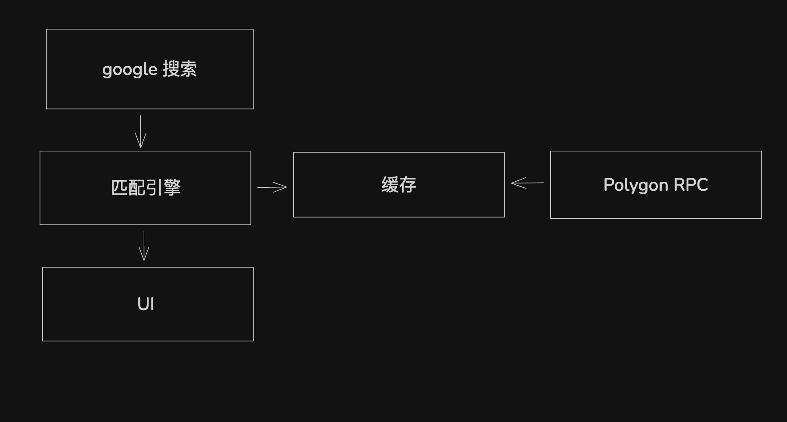

#  PolySearch 🔍

## 项目简介
PolySearch 是一款在 Google 搜索结果中自动呈现 Polymarket 预测市场实时胜率与链上数据的智能插件。

## 技术架构

本项目基于 Chrome 扩展 Manifest V3 架构开发，主要包含以下核心组件：
- **匹配引擎**: 结合 BM25 排名算法与倒排索引，实现毫秒级的本地市场检索。
- **前端注入**: 利用 Shadow DOM 实现与原网页隔离的毛玻璃风格 (Glassmorphism) UI，确保交互无冲突。
- **链上服务**: 直接连接 Polygon RPC 节点，实时解析 Polymarket CLOB 合约的原始 `OrderFilled` 事件日志。

## 快速开始

### 环境要求
- 现代浏览器 (Chrome / Edge / Brave)
- 有效的 Polygon RPC URL (项目已内置 1rpc, llamarpc 等公共节点)

### 安装步骤
1. 克隆仓库：`git clone <repository-url>`
2. 打开 Chrome 浏览器，进入 `chrome://extensions/`
3. 开启页面右上角的 **"开发者模式" (Developer mode)**
4. 点击 **"加载已解压的扩展程序" (Load unpacked)**
5. 选择本项目根文件夹 `polymarket_plugin`

### 运行命令
本项目采用原生 JavaScript 开发，无需额外的编译或构建步骤。
- **调试**: 在扩展程序页面点击 "背景页 (service worker)" 即可查看实时链上解析日志。

## 功能说明
- **智能搜索匹配**: 在 Google 搜索时自动识别并弹出相关的预测市场卡片。
- **动态概率展示**: 实时展示市场的成交概率、交易量及截止日期，支持数字滚动动画。
- **链上交易审计**: 直接从区块链原始日志中解析每一笔成交的价格与金额，确保数据透明。
- **滚动自动收纳**: UI 随搜索页面滚动自动收纳至顶部，提供无感的使用体验。

## 数据来源
- **Polymarket Gamma API**: 用于检索市场的详细描述、图标及元数据。
- **Polygon 区块链**: 通过 `eth_getLogs` 接口直接获取原始交易数据，分析全网实时成交热点。

